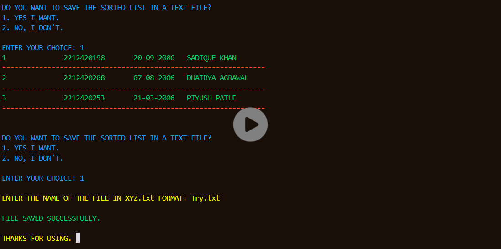

# Sort Student Records — Assign Roll Numbers

A simple yet powerful CLI program to sort student records.

## Features

- Allows to enter any amount of student data
- Sorts data based on name, enrolment number, and DOB
- Assigns roll numbers to students after sorting
- Saves the sorted data in a .txt file

## Technologies

- C

## Usage

1. Run the program
2. Enter the data of students
3. Select the criterion for sorting
4. Get the sorted data as the output

## Demonstration

## Author

Sadique Khan
